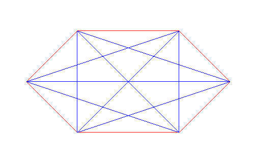

# Polygon Triangulation

I am interested in polygon triangulation algorithms. I am starting with a brute force approach.
We take a almost regular hexagonal polygon and try to triangulate it. I define it's points
and it's edges. I print the edges and the points. 
- A simple polygon is a polygon that does not intersect itself and doesn't have holes.

Couple of Interesting ideas:
- Given a simple polygon, we can always triangulate it.
- A simple polgon has a triangulation that has n-2 triangles.
- Number of such triangulations are given by catalan numbers
- We try to find a triangulation of a simple polygon using brute force approach where we find possible diagonals and check if they are valid diagonals. Then we subdivide the polygon and triangulate the sub polygons until we reach a triangle.

Results from Feb 22 Sat:
-  
- Red lines are the edges of the polygon and blue lines are the diagonals.

Note:
- Here we are not focusing on polygonalization and specifically on triangulation of a given 2d polygon.
- We are not focusing on the convexity of the polygon. We are focusing on the simple polygon.

#### Build and Run

```
- g++ -std=c++17 -o triangulate.exe triangulate.cpp -I/opt/homebrew/Cellar/sfml/3.0.0_1/include -L/opt/homebrew/Cellar/sfml/3.0.0_1/lib -lsfml-graphics -lsfml-window -lsfml-syste
- ./triangulate.exe
```
